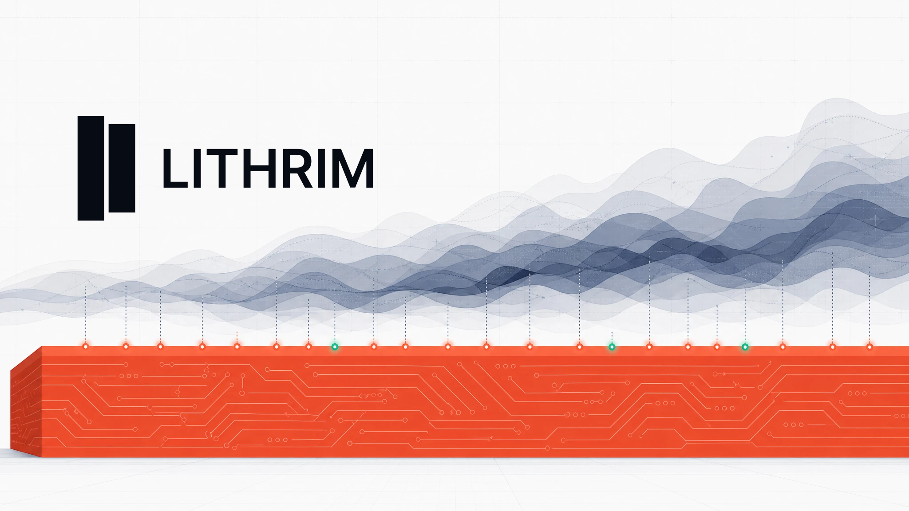

[](https://github.com/lithrim-dev/lithrim/actions/workflows/ci.yml)
[](LICENSE)
[](pyproject.toml)
[](https://doi.org/10.5281/zenodo.21270268)

**A self-hostable evaluation harness for AI agents — with a tool-grounded verification *floor* that can override a confident LLM judge, and an immutable audit trail on every run.**

> **Verifiable truth, not a promised win.** This README tells you exactly what Lithrim does — *and where it doesn't work.* That boundary is the point.

Bring your own model key. Run it on your laptop or in your VPC. **Your data never leaves your machine.**

---

## What it is

Most AI-eval tools end at an LLM-as-judge — a second model scoring the first. But a judge is as fallible as the thing it grades: it can confidently approve a fabricated fact, or confidently flag a correct one. Lithrim adds the layer underneath:

1. **A multi-model council** grades an artifact (a generated note, an HL7/FHIR output, a transcript-derived document) against a set of named flags, with **logprob-calibrated confidence** (a real probability from the model's own tokens — not a self-reported number).
2. **A deterministic, tool-grounded floor** then re-checks the council's findings against ground truth — a record, a schema, a terminology service — and can **override the verdict**: suppress a finding the council got confidently wrong, or block an output the council missed.
3. **An immutable audit record** captures every run — the votes, the floor's decision, and the evidence — so you can see *why*, not just *what*.

The floor is **three-state by design**: a finding is grounded-true, grounded-false, or **inconclusive** — and an inconclusive check is *surfaced, never silently flipped*. The system never manufactures certainty it doesn't have.

---

## Quickstart

Two ways in: **`make demo`** proves the loop in ~10s with no key or network; **`docker compose up`** brings up the full UI to explore on your own cases (bring your model key). Start with the demo:

**Zero-config demo — no keys, no network, runs in seconds.** See the full loop on a built-in case:

```bash
git clone https://github.com/lithrim-dev/lithrim && cd lithrim
pip install -e .   # core deps only (pydantic, pandas) — no LLM SDK needed for the demo
make demo          # replays a built-in case: council votes → floor flip PASS→BLOCK → audit
```

`make demo` replays a captured council baseline (so no LLM call, $0) and runs the **live deterministic floor** on the neutral built-in `_core` case — so the verdict flip is real and reproducible, not a recording. No key, no network, no domain pack required.

**Run it live on your own case (BYOK):**

```bash
pip install -e ".[bff,council,verification]"   # the extras the local BFF stack needs
export LITHRIM_LLM_PROVIDER=openai
export OPENAI_API_KEY=sk-...
make up          # local BFF + UI; grade your own artifact, nothing leaves the box
```

You provide the key; Lithrim provides the harness. No accounts, no hosted inference, no telemetry. OpenAI and Azure work from env (`LITHRIM_LLM_PROVIDER=azure` + the `AZURE_OPENAI_*` vars; see [`.env.example`](.env.example)); in the UI, **Connect AI** configures any of openai / anthropic / azure / gemini / openai-compatible per judge role — including a cross-provider council.

**Run it in containers — `docker compose up`.** No local Python/Node toolchain needed; a stranger gets the whole stack in two commands:

```bash
docker compose up   # builds + starts BFF (:8787), UI (:5180), and the JUTE mapper (:3031)
```

That's three services: the **BFF** (the API, `:8787`), the **UI** (`:5180`), and the bundled **JUTE mapper** (`:3031`, used only for ingesting arbitrary JSON; see [`docs/JUTE_MAPPER_ADDON.md`](docs/JUTE_MAPPER_ADDON.md)). If you never paste arbitrary JSON, `docker compose up bff ui` runs core-only and skips the mapper.

Then open **http://localhost:5180**, connect your own LLM key from the UI (or pass it as env — see below), and grade a case. The BFF auto-seeds the neutral `_core` sample on first boot, so the loop works immediately.

**No clone needed (prebuilt images).** Tagged releases publish `ghcr.io/lithrim-dev/lithrim-bff` and `ghcr.io/lithrim-dev/lithrim-ui` (multi-arch, via [`deploy/docker-compose.yml`](deploy/docker-compose.yml)): `mkdir lithrim && cd lithrim && curl -fsSLO https://raw.githubusercontent.com/lithrim-dev/lithrim/main/deploy/docker-compose.yml && docker compose up`. The prebuilt UI image is localhost-only by design (the BFF origin is baked at build time; the compose header documents the build-arg escape hatch). Full no-clone guide: [`docs/DEPLOY.md`](docs/DEPLOY.md).

**Agent setup.** Using Claude Code or another skills-aware agent? Setup skills ship in `.claude/skills/` (bring the stack up, wire the optional SNOMED terminology floor, run a first grade). Point the agent at a clone, or install the skills without one: see [`docs/AGENT_SKILLS.md`](docs/AGENT_SKILLS.md).

- **BYOK via env** — set keys in your shell or a repo-root `.env` (compose auto-loads `.env`); the `bff` service passes through `OPENAI_API_KEY`, the `AZURE_OPENAI_*` vars, `LITHRIM_LLM_PROVIDER`, `LITHRIM_BFF_TOKEN`, and `LITHRIM_BENCH_PACKS_DIR`. None are required for the offline demo.
- **Chat (conversational assistant)** — the local `claude` CLI can't run in a container, so in Docker assign the assistant a model in **Connect AI** (⋯ menu, bottom left → Assign models → `chat_assistant`) from **OpenAI, Azure, Gemini, or an OpenAI-compatible endpoint** (env alternative: `LITHRIM_CHAT_PROVIDER=openai` + `LITHRIM_CHAT_API_KEY`/`LITHRIM_CHAT_MODEL`). The Anthropic/BYO-Claude path needs the host CLI and is host-run only. **Grading and the offline demo do not need chat.**
- **Clean by construction + persistence** — a fresh `docker compose up` seeds only the neutral `_core` sample; it never inherits a dev `./out/`. Your evaluations, config, **and keys you connect from the UI** persist in a Docker-managed named volume (`lithrim_out`) across `up`/`down`; `docker compose down -v` resets everything to the clean seed. Nothing leaves your machine.
- **Upgrading** — after a `git pull`, rebuild: `docker compose up --build` (a plain `up` reuses the old images and silently runs stale code).
- **Offline `$0` smoke** — `make demo` (no keys, no network) still runs on the host exactly as above; it does not require the containers.

> The browser talks to the BFF at `http://localhost:8787` (host-published + CORS-allowed) — *not* the container-internal `bff` hostname. Both ports are published to the host. To point the UI at a different published BFF origin, set `VITE_BFF_URL` before `docker compose up --build`.
>
> **Owner-run smoke (not automated):** after `docker compose up`, verify `curl -sf http://localhost:8787/health` is OK, the UI loads at `:5180`, and a host-side `make demo` REJECTs (flips PASS→BLOCK) with no keys. Agents lint the compose file (`docker compose config`) but don't start the Docker daemon.

**Exposing the server.** Left unset, the BFF is open for local single-user — zero friction. Put it on a network and set `LITHRIM_BFF_TOKEN=<token>` to require a Bearer token on every request: callers pass `Authorization: Bearer <token>` (or `X-API-Key: <token>`); the shell reads it from `VITE_BFF_TOKEN`. `/health` and CORS preflight stay open.

---

## The flagship loop

```
artifact ─▶ multi-model council ─▶ findings + calibrated confidence
                                        │
                                        ▼
                          tool-grounded floor (record / schema / terminology)
                                        │
              ┌─────────────────────────┼─────────────────────────┐
              ▼                         ▼                          ▼
     suppress a wrong finding    block a missed defect    inconclusive → surfaced
                                        │
                                        ▼
                          verdict  +  immutable audit record
```

`make demo` walks exactly this loop on the `_core_fabricated_claim` case: the council returns `PASS`, the deterministic floor catches the fabricated guarantee and flips the verdict to `BLOCK`, and the audit surfaces the `UNSUPPORTED_ASSERTION` / `SOURCE_CONTRADICTION` findings as the *why*.

---

## Architecture

| Layer | What it does |
|---|---|
| **Council** | Multi-model LLM judges, evidence-based consensus, logprob-calibrated confidence. (Frozen, byte-stable core.) |
| **Grounding floor** | `contract_type → executor` (in-process or service-transport); three-state, verdict-overriding, never silently flips. |
| **Packs** | A pack supplies the domain (ontology, flags, prompts, floors). The shipped default is the neutral `_core`; domain packs are pluggable and load from outside the repo. |
| **Plugins** | A unified registry (`kind: contract / provider / tool / pack`) — add a scorer, provider, or connector by manifest. |
| **Audit spine** | Append-only audit records + run provenance (which models, which plugins, what evidence). |

By-construction labeling is the bench's discipline: where it ships labeled cases, the label is *generated*, not annotated — the recipe that injects a defect **is** the label's justification.

### Packs load from OUTSIDE the repo

This repo is the genuinely domain-agnostic OSS core — it ships the engine plus the neutral `_core` pack and a non-clinical sample pack. A **domain** is a *pack*: a `pack.json` bundling an ontology + taxonomy + council role prompts + grounding floors + dataset generators. The core resolves a pack id in order:

1. an installed **entry point** in the `lithrim_bench.packs` group (the pip path);
2. **`LITHRIM_BENCH_PACKS_DIR`** — `os.pathsep`-joined external dirs (the dev / airgap path), pinned active with **`LITHRIM_BENCH_PACK`**;
3. the in-repo `packs/` (the sample packs + fixtures).

With no pack on the path the core stays on the neutral `_core` default and grades fine. To add your own domain, write a pack repo with a `pack.json` + the entry point and point the env var at it — **zero engine edits**.

**Add a pack (drop-in).** With `docker compose`, drop a pack **folder** into `packs-dropin/` (bind-mounted to `/dropin-packs`, the default `LITHRIM_BENCH_PACKS_DIR`) — or point `LITHRIM_BENCH_PACKS_DIR` at any directory — then restart. `GET /v1/packs` then shows it (with the active pack marked), and any portable agents it declares (`pack.json` → optional `seed_agents`) are seeded into the config DB so they appear in the rail. An empty `packs-dropin/` ⇒ a clean `_core` CE. Pro packs are `tier: pro` (license-gated via `LITHRIM_BENCH_LICENSE`; the default is permit-all). The `seed_agents` contract is documented in [`packs-dropin/README.md`](packs-dropin/README.md).

---

## Connectors (MCP / tools)

The floor and judges can call external services — a terminology server, a schema validator, a retrieval tool — as **connectors**. MCP is the transport standard. A connector is a manifest entry (`transport: service | in_process`) plus an executor; secrets ride env vars, never the manifest. See **[`docs/specs/SPEC_TOOL_CONNECTORS.md`](docs/specs/SPEC_TOOL_CONNECTORS.md)** for the contract and reference connectors (a SNOMED terminology grounder and a web-search retriever).

**Graceful by default:** a connector that isn't configured or reachable resolves to *inconclusive* — the harness still grades, it just tells you what it couldn't verify. You don't need any sidecar to run.

---

## What Lithrim honestly does — and does NOT do

This is the part most tools omit. The floor's power is **bounded**, and we tested the boundary with a blind held-out experiment rather than asserting it:

- **✅ Where the floor generalizes — closed-vocabulary / structured facts.** Dosage arithmetic, code/terminology membership (SNOMED/ICD), schema/FHIR conformance, record presence. The check is set-membership or arithmetic, so it generalizes to unseen cases and can reliably override a judge.
- **❌ Where it does NOT generalize — open-ended discourse.** Detecting an open-ended concept in free text (e.g. "was a refusal documented?") is open NLU. A deterministic/lexical floor here either misses novel phrasings or false-flags paraphrases. **In a blind held-out test, a serious 30-pattern rule scored recall 0.375 / precision 0.75 — it does not generalize.** For that class, an LLM judge (or a human-in-the-loop) is the right tool, not a deterministic floor.

So: **use the floor for grounded, structured claims; use the judge (and a human) for open-ended discourse.** Lithrim is honest about which is which — and surfaces an inconclusive when it can't ground something, instead of guessing.

This is not "a better judge." Judges are commodity. This is **the grounded floor underneath the judge, with an honest map of its own limits.**

> **Intended use & safety.** Lithrim is a developer evaluation harness — **not a medical device and not clinical decision support.** It does not diagnose, treat, or give medical advice, and it is **not HIPAA-certified, FDA-cleared, or clinically validated.** Its verdicts are signals to route human review, not guarantees of correctness or safety; any clinical use requires qualified human oversight. All bundled sample data is **synthetic** (Synthea-generated) — never load real patient data into a deployment you don't control.

---

## Your data & keys stay local

Lithrim is self-hosted. There is no Lithrim-hosted inference, no account, no telemetry.

- **The demo needs nothing** — no key, no network.
- **For a live grade you provide the key** (BYOK): copy [`.env.example`](.env.example) to `.env` and fill in `OPENAI_API_KEY` (or the `AZURE_OPENAI_*` vars). Your real `.env`, `.live_env`, and `.connector_env` are **gitignored** — they never enter the repo, and nothing leaves your machine.

> **Auth is deferred.** A local self-hosted run doesn't need it. Authentication for *exposed* deployments is coming; for now, run it where you trust the network.

---

## Status

This is a **community release** — a working harness and a runnable demo, not a finished product.

- **Stable:** the council, the calibrated-confidence read, the grounding-floor mechanism, the by-construction labeling, the audit spine, the neutral `_core` pack, BYOK (single-provider).
- **Experimental / evolving:** the full connector plane (reference connectors are wired; the SPEC is the design), the conversational UI surface, multi-provider councils.
- **Not included here:** auth (a local self-hosted run doesn't need it — coming for exposed deployments).

We'd rather ship a smaller honest thing than a broad one that over-promises.

---

## Open-core

The engine, the harness, the neutral `_core` pack, the sample packs, and the plugin/connector interface are **all open** (see [`LICENSE`](LICENSE)) — because adoption beats protecting the bits, and the moat was never the cases. A small **synthetic clinical sample pack** (`clinical_scribe`) ships in CE so the clinical thesis is runnable on a fresh clone — five by-construction failure modes (missing allergy, wrong dosage, fabricated history, negation reversal, diagnosis upcoding) plus a clean negative, all synthetic. It's a teaser, not the product: the full curated clinical `healthcare` domain pack (the calibrated corpus + the SME calibration loop) is distributed separately (its own repo) and loads through the pack-discovery seam above. Future commercial value (calibration, the SME-calibration loop, larger curated corpora, hosted/VPC, support) is **deferred until there's pull** — and would be *new* value, not a re-closing of what ships open here. The free core is **genuinely useful standalone** — not a crippled teaser.

---

## Research

Lithrim backs the technical report *A grounded evaluation architecture for clinical scribes: a configuration-controlled study of LLM judges and a deterministic grounding floor*, the empirical case that an LLM judge cannot be trusted to certify its own safety, and that a deterministic floor grounded in something real measurably corrects it. Report + data: DOI [10.5281/zenodo.21270268](https://doi.org/10.5281/zenodo.21270268) (concept DOI [10.5281/zenodo.21270267](https://doi.org/10.5281/zenodo.21270267), resolves to the latest version); preregistration: OSF [10.17605/OSF.IO/2ZU4H](https://doi.org/10.17605/OSF.IO/2ZU4H). To reproduce the study from this repo, see [`REPRODUCING.md`](REPRODUCING.md). The engine spec (the by-construction defect taxonomy) is [`docs/EVAL_BENCHMARK_AND_DETERMINISM_SPEC.md`](docs/EVAL_BENCHMARK_AND_DETERMINISM_SPEC.md).

---

## Docs

| Doc | What it covers |
|---|---|
| [`SETUP.md`](SETUP.md) | The hands-on path: Docker stack, connect a key, first grade, read the verdict + audit trail (~15 min). |
| [`docs/DEPLOY.md`](docs/DEPLOY.md) | Run the prebuilt images with no clone or build: `curl` the compose file and `docker compose up`. |
| [`docs/AGENT_SKILLS.md`](docs/AGENT_SKILLS.md) | The shipped Agent Skills (stack up, first grade, SNOMED floor) and how to install them, clone or no-clone. |
| [`docs/CAPABILITY_CARD.md`](docs/CAPABILITY_CARD.md) | What the deterministic floor verifies, what it does not, and how it abstains. |
| [`docs/ARCHITECTURE.md`](docs/ARCHITECTURE.md) | The components (engine, packs, council, floor, BFF, UI, mapper) and how they connect. |
| [`docs/JUTE_MAPPER_ADDON.md`](docs/JUTE_MAPPER_ADDON.md) | The bundled ingest mapper: what needs it, what doesn't, how to run core-only. |
| [`docs/SNOMED_SETUP.md`](docs/SNOMED_SETUP.md) | Optional SNOMED terminology floor: licensing reality first, building the Hermes index, in-container MCP wiring. |
| [`REPRODUCING.md`](REPRODUCING.md) | Re-running the published study from this repo. |
| [`CONTRIBUTING.md`](CONTRIBUTING.md) | Dev setup, optional extras, test/lint expectations. |

The full index of tracked docs is [`docs/README.md`](docs/README.md).

---

## FAQ

**Is it local-first?** Yes. Self-hosted, no accounts, no Lithrim-hosted inference, no telemetry. The only outbound traffic is the calls your own model key makes to your own provider.

**What does it cost to run?** The harness is free (Apache-2.0). `make demo` is $0 (no key, no network). A live grade spends your own provider key (BYOK), one council run is one set of model calls, and the UI shows a cost-confirm before any paid run.

**Is it clinically validated?** No. Lithrim is a developer evaluation harness, not a medical device, not clinical decision support, not HIPAA-certified, not FDA-cleared. All bundled sample data is synthetic. See the intended-use note above.

**What's the research behind it?** A configuration-controlled study of LLM judges over a deterministic grounding floor: DOI [10.5281/zenodo.21270268](https://doi.org/10.5281/zenodo.21270268). [`REPRODUCING.md`](REPRODUCING.md) re-runs it from this repo.

**Do I need the clinical pack?** No. The core is domain-agnostic and grades standalone on the neutral `_core` pack. Domains are pluggable packs; a small synthetic clinical sample ships for the demo.

---

## Contributing

Issues and PRs welcome. The one rule that mirrors the philosophy: **no manufactured wins** — a benchmark result must be reproducible, a label must be justified by construction, and a claim must say where it *doesn't* hold. Lint is `ruff` (`make lint`). Run the full suite with the optional extras installed: `pip install -e ".[dev,council,verification,bff,agent]"` then `make test`.

## License

**Apache-2.0** — see [`LICENSE`](LICENSE).

---

*Lithrim is built on the premise that an AI system cannot be trusted to certify its own safety — the check has to live outside it, be grounded in something real, and be honest about its own blind spots. If you find a place it over-claims, open an issue. That's the contribution we value most.*
